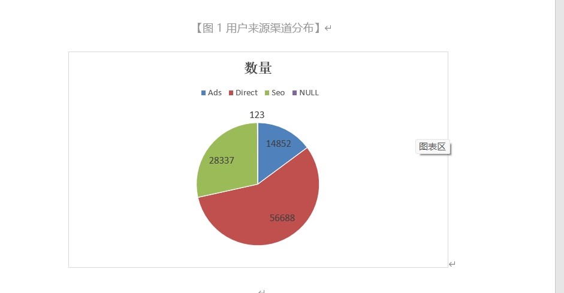
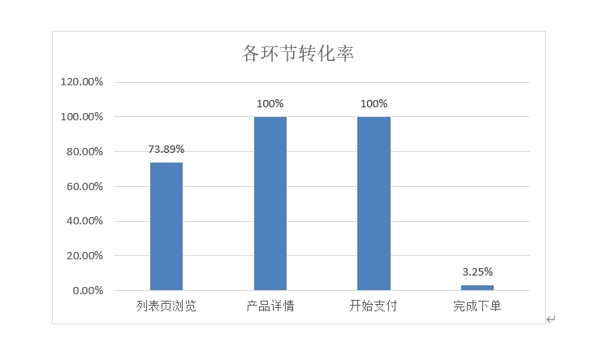
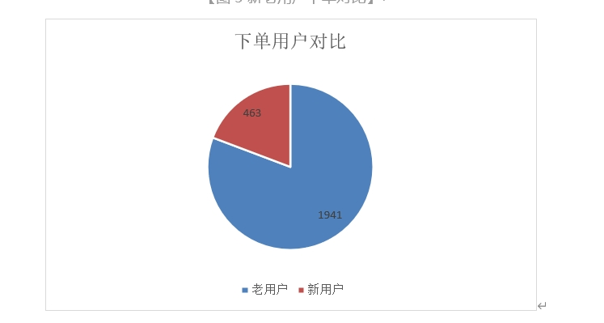

# 电商用户行为分析项目

## 1. 项目简介

本项目基于某电商平台用户行为数据，使用 SQL 对用户访问、页面转化、流量来源、新老用户差异和下单行为进行分析。

项目围绕电商运营中的关键问题展开：用户从访问到下单的过程中在哪些环节发生流失？不同流量渠道的用户质量是否存在差异？新老用户在访问深度和购买转化上有什么不同？通过本项目，可以为首页优化、渠道投放、支付转化提升和用户生命周期运营提供数据支持。

## 2. 项目背景

随着电商行业竞争加剧，单纯依靠流量增长已经难以持续提升 GMV。平台需要通过数据分析识别用户行为路径中的关键流失点，并针对不同来源、不同类型用户制定差异化运营策略。

本项目基于用户访问行为数据，使用 SQL 完成数据清洗、指标计算和多维度分析，重点关注以下三个方向：

* 用户来源渠道效果评估
* 全链路转化漏斗诊断
* 新老用户行为差异分析

## 3. 数据说明

本项目数据来自某品牌线上电商平台用户访问记录，共计约 100,000 条用户记录。

原始数据包含用户基本信息、访问路径、流量来源、设备信息和下单结果等字段。

| 字段名                       | 含义                |
| ------------------------- | ----------------- |
| user_id                   | 用户 ID             |
| new_user                  | 是否新用户，1=新用户，0=老用户 |
| age                       | 用户年龄              |
| sex                       | 用户性别              |
| market                    | 市场级别              |
| device                    | 用户设备              |
| operative_system          | 操作系统              |
| source                    | 流量来源              |
| total_pages_visited       | 浏览页面总数            |
| home_page                 | 是否浏览主页            |
| listing_page              | 是否浏览列表页           |
| product_page              | 是否浏览产品详情页         |
| payment_page              | 是否浏览支付页           |
| payment_confirmation_page | 是否完成支付            |

## 4. 分析目标

本项目主要围绕以下问题展开分析：

1. 平台整体流量规模、独立用户数、下单人数和人均浏览深度表现如何？
2. 从主页到确认支付的完整转化链路中，哪个环节流失最严重？
3. SEO、Direct、Ads 等不同来源渠道的用户规模和转化表现如何？
4. 新用户和老用户在访问深度、转化率和下单行为上有什么差异？
5. 如何基于分析结果提出首页优化、支付优化和用户运营建议？

## 5. 指标体系

### 5.1 流量与用户基础指标

| 指标     | 计算方式                                 | 业务含义       |
| ------ | ------------------------------------ | ---------- |
| 总访问量   | COUNT(*)                             | 平台整体流量规模   |
| 独立用户数  | COUNT(DISTINCT user_id)              | 去重后的真实用户规模 |
| 总下单人数  | COUNT(payment_confirmation_page = 1) | 完成购买的用户数量  |
| 人均浏览页数 | AVG(total_pages_visited)             | 用户访问深度     |

### 5.2 转化漏斗指标

| 指标          | 计算方式                                           | 业务含义       |
| ----------- | ---------------------------------------------- | ---------- |
| 主页到列表页转化率   | listing_page 人数 / home_page 人数                 | 首页导流效果     |
| 列表页到详情页转化率  | product_page 人数 / listing_page 人数              | 商品列表吸引力    |
| 详情页到支付页转化率  | payment_page 人数 / product_page 人数              | 商品详情页购买转化力 |
| 支付页到确认支付转化率 | payment_confirmation_page 人数 / payment_page 人数 | 支付流程完成率    |
| 整体转化率       | payment_confirmation_page 人数 / home_page 人数    | 端到端购买转化效果  |

### 5.3 用户分群指标

| 指标      | 计算方式               | 业务含义       |
| ------- | ------------------ | ---------- |
| 新用户占比   | 新用户数 / 总用户数        | 平台获客能力     |
| 老用户下单数  | 老用户中完成下单人数         | 老用户购买活跃度   |
| 新老用户转化率 | 按 new_user 分组计算转化率 | 新老用户购买意愿差异 |

### 5.4 来源渠道指标

| 指标     | 计算方式                     | 业务含义     |
| ------ | ------------------------ | -------- |
| 各渠道用户量 | GROUP BY source COUNT(*) | 渠道流量贡献   |
| 各渠道转化率 | 按 source 分组计算整体转化率       | 渠道用户质量对比 |

## 6. 分析流程

### 6.1 数据清洗

主要处理内容包括：

1. 删除重复记录
2. 检查并处理缺失值
3. 识别异常值
4. 统一字段含义
5. 将页面访问字段作为 0/1 标记用于漏斗分析

### 6.2 基础指标分析

统计平台整体访问量、独立用户数、下单用户数和人均浏览页数，判断平台整体用户基础和流量规模。

### 6.3 转化漏斗分析

按照用户访问路径构建转化漏斗：

```text
主页浏览 → 列表页浏览 → 产品详情页浏览 → 支付页浏览 → 确认支付
```

通过计算各环节转化率，定位用户流失最严重的环节。

### 6.4 来源渠道分析

对 SEO、Direct、Ads 等流量来源进行分组统计，分析不同渠道的用户规模和转化表现，判断平台主要流量来源和潜在增长空间。

### 6.5 新老用户分析

基于 new_user 字段区分新用户和老用户，比较两类用户在下单人数和转化表现上的差异，为用户生命周期运营提供依据。

## 7. 核心分析结果

### 7.1 Direct 和 SEO 是主要流量来源

从用户来源分布看，Direct 和 SEO 是平台最主要的用户来源，说明平台已经具备一定品牌认知和自然流量基础。

主要渠道用户量如下：

| 渠道     |    用户量 |
| ------ | -----: |
| Direct | 56,688 |
| SEO    | 28,337 |
| Ads    | 14,852 |
| NULL   |    123 |

### 7.2 转化漏斗存在明显后端流失

转化漏斗显示，支付页到确认支付环节转化率较低，说明用户已经到达支付页后仍有大量流失，支付流程、价格敏感度、优惠刺激或信任感可能是影响最终成交的重要因素。

主要转化率如下：

| 漏斗环节        |     转化率 |
| ----------- | ------: |
| 主页 → 列表页    |  73.89% |
| 列表页 → 产品详情页 | 100.00% |
| 产品详情页 → 支付页 | 100.00% |
| 支付页 → 确认支付  |   3.25% |

### 7.3 老用户下单贡献明显高于新用户

从新老用户下单对比看，老用户下单人数明显高于新用户，说明平台存量用户价值较高，老用户忠诚度和购买意愿更强。

| 用户类型 |  下单人数 |
| ---- | ----: |
| 老用户  | 1,941 |
| 新用户  |   463 |

## 8. 可视化结果

### 用户来源渠道分布



### 转化漏斗各环节转化率



### 新老用户下单对比



## 9. 业务建议

### 9.1 优化首页导流效率

主页到列表页转化率仍有提升空间。建议优化首页商品入口、活动入口和导航结构，让用户更快进入商品浏览场景。

可执行策略：

* 提升首页核心商品曝光
* 增加热门分类和爆款商品入口
* 优化首页 Banner 和活动模块
* 缩短用户从首页到商品列表的路径

### 9.2 优化支付转化环节

支付页到确认支付环节转化率较低，是当前最关键的转化瓶颈。

可执行策略：

* 简化支付流程
* 增加优惠券、满减、限时折扣等临门一脚激励
* 增强支付页信任感，如售后保障、物流说明、退换货政策
* 排查支付页加载速度、支付方式和异常报错问题

### 9.3 强化老用户运营

老用户下单贡献明显高于新用户，说明老用户具备较高运营价值。

可执行策略：

* 建立会员等级体系
* 推出老用户复购券
* 进行个性化商品推荐
* 策划老带新活动，利用老用户带动新用户增长

### 9.4 提升新用户首单转化

新用户下单人数低于老用户，说明新客转化仍有提升空间。

可执行策略：

* 设置新用户首单优惠
* 优化新用户注册和下单路径
* 在首页突出新人专享权益
* 对不同渠道新用户进行差异化转化策略

## 10. 项目文件说明

```text
ecommerce-user-behavior-analysis/
│
├── README.md
├── data/
│   └── README.md
├── sql/
│   ├── 01_data_cleaning.sql
│   ├── 02_basic_metrics.sql
│   ├── 03_funnel_analysis.sql
│   ├── 04_source_analysis.sql
│   └── 05_new_old_user_analysis.sql
├── images/
│   ├── source_distribution.png
│   ├── conversion_funnel.png
│   └── new_old_user_orders.png
└── reports/
    └── 电商用户行为分析项目报告.pdf
```

## 11. 使用工具

* SQL：数据清洗、指标计算、分组统计、转化漏斗分析
* Excel：图表制作、基础数据透视分析
* 漏斗分析：识别用户转化路径中的关键流失环节
* 用户分群：对比新老用户行为差异
* 渠道分析：评估不同来源渠道的用户规模和转化表现

## 12. 项目总结

本项目通过 SQL 对电商平台用户行为数据进行分析，完成了从基础流量指标、转化漏斗、来源渠道到新老用户对比的完整分析流程。

分析结果表明，平台主要流量来自 Direct 和 SEO，自然流量基础较好；转化链路中的支付确认环节存在明显流失，是后续优化重点；老用户下单贡献明显高于新用户，说明平台应继续强化老用户运营，同时通过首单优惠和老带新活动提升新用户转化。

